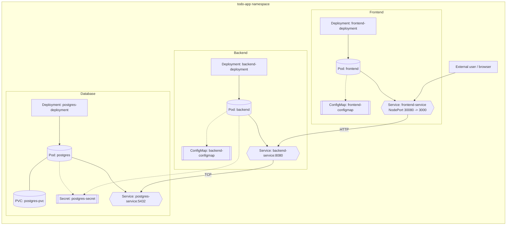

## Phase 02 — Kubernetes Application (Tasks)

In this phase the [application](../../application/) will be **deployed with Kubernetes**, following small, verifiable steps. The goal is to learn how to create and manage Kubernetes resources (Deployments, Services, ConfigMaps, Secrets, PVCs) for a typical web app (frontend + backend + postgres).

I recommend checking off each task as you complete it in this file.

---

### 1. Preparation — Namespace

- **1.1. Create a dedicated namespace**
  - Suggested file: `namespace.yaml`.
  - Define a namespace (e.g., `todo-app`) to isolate all resources for this application.
  - Apply it: `kubectl apply -f namespace.yaml`
  - Verify: `kubectl get namespaces`

- **1.2. Set the namespace as default context (optional but recommended)**
  - `kubectl config set-context --current --namespace=todo-app`
  - This avoids having to pass `-n todo-app` in every command.

- **1.3. Identify what you need to deploy**
  - Components: frontend, backend, database.
  - For each one, determine:
    - the container image,
    - exposed ports,
    - required environment variables,
    - whether it needs persistent storage.

- **1.4. Build and load container images (local cluster only)**
  - In a future phase, a private registry for Images (Harbor) will be used to store image. For now:
    - Build each image locally: `docker build -t <image>:<tag> .`
    - Load it into your cluster nodes: `minikube image load<image>:<tag>`
    - In the corresponding Deployment manifests, set `imagePullPolicy: IfNotPresent` to avoid unnecessary pull attempts.
  - Repeat this for every component that uses a custom image (backend, frontend, etc.).

---

### 2. Backend Deployment


- **2.1. Create the backend Deployment**
  - Suggested file: `backend-deployment.yaml`.
  - It should include:
    - `metadata.namespace: todo-app`,
    - The backend container image,
    - The correct `containerPort`,
    - The minimum environment variables required to start.

- **2.2. Create the backend Service**
  - Suggested file: `backend-service.yaml`.
  - Type `ClusterIP`.
  - `metadata.namespace: todo-app`.
  - Exposes the HTTP port of the backend.
  - Uses labels (`selector`) that match those of the Deployment.

- **2.3. Apply and test**
  - `kubectl apply -f backend-deployment.yaml`
  - `kubectl apply -f backend-service.yaml`
  - Check:
    - `kubectl get pods -n todo-app`
    - `kubectl logs <backend-pod> -n todo-app`
  - Use `kubectl port-forward svc/backend <local-port>:<service-port> -n todo-app` to verify the service is responding.

---

### 3. Database (Postgres) Deployment with PVC

- **3.1. Create a PersistentVolumeClaim**
  - Suggested file: `postgres-pvc.yaml`.
  - `metadata.namespace: todo-app`.
  - Define:
    - `storageClassName` (if needed),
    - `resources.requests.storage` (e.g., `1Gi`),
    - `accessModes: [ReadWriteOnce]`.

- **3.2. Create a Secret for Postgres credentials**
  - Suggested file: `postgres-secret.yaml`.
  - `metadata.namespace: todo-app`.
  - It should contain, for example:
    - `POSTGRES_USER`,
    - `POSTGRES_PASSWORD`,
    - `POSTGRES_DB`.
  - Reference them later using `envFrom` or `env`.

- **3.3. Create the Postgres Deployment (or simple StatefulSet)**
  - Suggested file: `postgres-deployment.yaml`.
  - `metadata.namespace: todo-app`.
  - Mount the PVC at the data path (e.g., `/var/lib/postgresql/data`).
  - Use environment variables from the Secret.

- **3.4. Create the Postgres Service**
  - Suggested file: `postgres-service.yaml`.
  - Type `ClusterIP`.
  - `metadata.namespace: todo-app`.
  - Standard port 5432.

- **3.5. Apply and verify**
  - `kubectl apply -f postgres-pvc.yaml`
  - `kubectl apply -f postgres-secret.yaml`
  - `kubectl apply -f postgres-deployment.yaml`
  - `kubectl apply -f postgres-service.yaml`
  - Check:
    - That the Pod is `Running`: `kubectl get pods -n todo-app`
    - That the PVC is `Bound`: `kubectl get pvc -n todo-app`
    - That you can connect from a temporary Pod (`kubectl run` + `psql`) using the Service.

---

### 4. Connect backend ↔ Postgres using ConfigMap + Secret

- **4.1. Create a ConfigMap for backend configuration**
  - Suggested file: `backend-configmap.yaml`.
  - Include **non-sensitive** variables, such as:
    - database name,
    - host (`POSTGRES_HOST=postgres` → name of the Service),
    - port.

- **4.2. Adjust the backend Deployment**
  - Import:
    - ConfigMap with `envFrom` or `env`,
    - Postgres Secret (if the backend needs credentials directly).
  - Make sure the backend points to the **Postgres Service** (`postgres.todo-app.svc.cluster.local` or simply `postgres` within the same namespace), not `localhost`.

- **4.3. Apply changes and test**
  - `kubectl apply -f backend-configmap.yaml`
  - `kubectl apply -f backend-deployment.yaml` (updated).
  - Verify that the backend can connect to Postgres:
    - check backend logs,
    - make requests that require DB access.

---

### 5. Frontend in Kubernetes

- **5.1. Create the frontend Deployment**
  - Suggested file: `frontend-deployment.yaml`.
  - Use the current frontend image.
  - Make sure the container exposes the correct port.

- **5.2. Configure the backend URL**
  - Decide whether the backend URL is:
    - compiled into the image (build-time), or
    - provided as an environment variable/config at runtime (ideally via ConfigMap).
  - If runtime:
    - create `frontend-configmap.yaml` with the backend URL (using the `backend` Service).
    - mount the config in the Pod.

- **5.3. Create the frontend Service**
  - Suggested file: `frontend-service.yaml`.
  - Type `NodePort` to expose the app outside the cluster.
  - Keep `port` and `targetPort` aligned with the container port mapping.
  - Define a fixed `nodePort` (for example, `30080`) for predictable access during testing.

- **5.4. Apply and test**
  - `kubectl apply -f frontend-deployment.yaml`
  - `kubectl apply -f frontend-service.yaml`
  - Validate external exposure:
    - `kubectl get svc frontend-service -n todo-app`
    - Access from your host with `<node-ip>:<nodePort>` (for Minikube: `minikube service frontend-service -n todo-app --url`).
  - Verify that the frontend can successfully communicate with the backend inside the cluster.

---

### 6. Internal architecture review

- **6.1. Draw (even on paper) the internal diagram**
  - Include:
    - frontend, backend, Postgres Pods/Deployments,
    - corresponding Services,
    - PVC for Postgres,
    - ConfigMaps and Secrets, and which Deployment uses them.



- **6.2. Check the internal DNS names**
  - Use temporary Pods to:
    - `ping backend-service`,
    - connect to `postgres-service:5432`,
    - send HTTP requests to `frontend-service`/`backend-service` by Service name.

---

### 7. Cleanup and basic best practices

- **7.1. Consistent names and labels**
  - Ensure that:
    - `metadata.name` for Deployments/Services/ConfigMaps/Secrets are consistent,
    - labels (`labels`) and `selectors` match up (e.g., `app: backend` on all backend resources).

- **7.2. Separate sensitive/non-sensitive config**
  - Review:
    - what belongs in ConfigMaps,
    - what belongs in Secrets.

- **7.3. Document decisions**
  - Add brief comments in YAML manifests only when necessary to remember important decisions (for example, why you chose a certain PVC size).

---

### 8. Phase 02 Completion Criteria

Mark this phase as complete when:

- [ ] Backend, frontend, and Postgres are running in Kubernetes as Deployments (or StatefulSet for DB if you choose).
- [ ] Backend and Postgres have ClusterIP Services.
- [ ] Frontend is exposed with a NodePort Service and reachable from outside the cluster.
- [ ] Postgres uses a PVC for persistent data.
- [ ] Non-sensitive configuration is in ConfigMaps.
- [ ] Credentials are in Secrets.
- [ ] The frontend can talk to the backend and the backend to Postgres using **Service names**, not static IPs.
- [ ] You are able to explain, in your own words, what role each resource plays: Deployment, Service, ConfigMap, Secret, PVC.

---

### Tip: Applying all manifests at once

Instead of applying each file individually, `kubectl apply -f` accepts a directory and processes every `.yaml` file inside it:

```bash
# Apply the namespace first
kubectl apply -f manifests/namespace.yaml

# Then apply everything else recursively
kubectl apply -f manifests/database/
kubectl apply -f manifests/backend/
kubectl apply -f manifests/frontend/

# Or apply the entire manifests directory at once (includes namespace + all subdirectories)
kubectl apply -R -f manifests/
```

The `-R` flag makes it recursive, so it walks into subdirectories (`database/`, `backend/`, `frontend/`) and applies all `.yaml` files found. This is idempotent — running it again only updates resources that changed.
